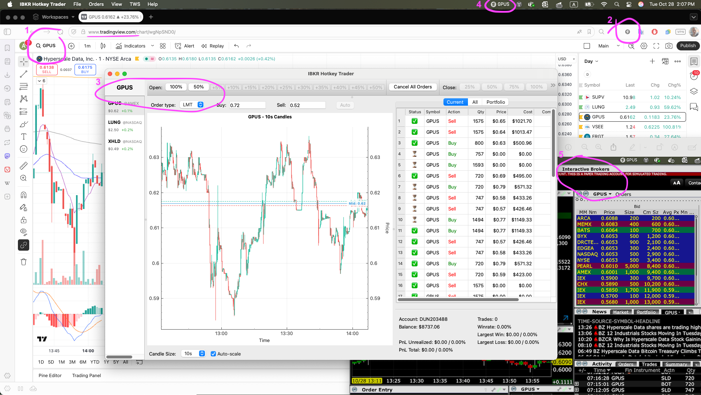

# IBKR Hotkey Trader

A reactive hotkey intraday trading with **TradingView** and **TWS** (InteractiveBrokers Trader Workstation), enabling window symbol sync and qty calculation using real-time market data (subscription required).


Windows sync:
1. TradingView
2. Chrome browser extension
3. IBKR Hotkey Trader app
4. Global MacOS hotkeys 
5. IBKR Trader Workstation (TWS) Dashboard


## Features

- **Rapid Trading**: Execute buy/sell orders instantly using keyboard shortcuts
- **LMT/MKT**: Limit price calculation based on market tick-by-tick updates
- **QTY**: Automatic rounded Qty calculation (%) based on your buying power
- **TradingView** current symbol synchronization with Hotkey Trader and TWS

Experimental features: portfolio, order history, live chart, statistics, debug logs


## Requirements

### InteractiveBrokers Setup
1. **Market Data Subscription**
   - Required for the app to receive real-time price updates
   - Log in to your IBKR account portal
   - Go to **Account Management → Market Data Subscriptions**
   - Subscribe to a market data package, for example:
     - **NASDAQ (Network C/UTP)(NP,L1)** - $1.50/month
     - **NYSE (Network A/CTA) (NP,L1)** - $1.50/month
     - **NYSE American, BATS, ARCA, IEX, and Regional Exchanges (Network B) (NP,L1)** - $1.50/month
     - **US Securities Snapshot and Futures Value Bundle (NP,L1)** (alternative to above) - $10/month
     - **US Equity and Options Add-On Streaming Bundle (NP)** (optional) - $4.5/month
     - Or other (world-wide) packages based on your trading needs
   - Extra L2 subscriptions (recommended)
     - **NASDAQ BX TotalView(NP,L2)** - $3.5/month
     - **NYSE ArcaBook (NP,L2)** (optional) - $11/month

2. **TWS (Trader Workstation)** or **IB Gateway** installed and running

3. Enable API connections in TWS:
   - Go to **File → Global Configuration → API → Settings**
   - Check **Enable ActiveX and Socket Clients**
   - **Uncheck** **Read-Only API** to allow trading
   - Set **Master API client ID** to `0` (some of our call require master client id)
   - Set **Download open orders on connection** to `All Available`
   - Check **Allow connections from localhost only** (recommended for security)
   - Note the **Socket port** (default: 7496 for TWS, for convenience you can set the same port for paper account)

4. **First Order Confirmation** (one-time):
   - When you place your first order, TWS will show a confirmation popup
   - Click **Yes** to execute the order immediately
   - Check **Remember my answer** if you want all future orders to execute without confirmation
   - This is a TWS security feature to prevent accidental order execution

### System Requirements
- macOS 10.15+
- Qt 6.2+
- CMake 3.16+
- Protocol Buffers (protobuf) compiler
- Abseil C++ library
- C++17 compatible compiler


## Installation

### 1. Install dev tools

```bash
brew install cmake qt@6 protobuf abseil
```

### 2. Clone the Repository and download dependencies

```bash
git clone https://github.com/kinect-pro/ibkr-hotkey-trader.git
cd ibkr-hotkey-trader
```

The app requires the Interactive Brokers TWS API C++ client library (not included in this repository).

**Automatic Setup (Recommended):**
```bash
./download_tws_api.sh
./download_qcustomplot.sh
```

This script will:
- Download the latest TWS API (~10MB)
- Extract to `external/twsapi/`
- Verify installation

Takes ~1 minute depending on your connection.

**Manual Setup (if script doesn't work):**
1. Go to https://interactivebrokers.github.io/
2. Download the TWS API (any platform version works)
3. Extract the archive
4. Copy/move the extracted folder to `external/twsapi` in this project
5. Verify: `external/twsapi/source/cppclient/client` directory exists

### 3. Build the Application

#### macOS / Linux
```bash
mkdir build
cd build
cmake ..
make
```

#### Windows
```bash
mkdir build
cd build
cmake .. -G "Visual Studio 17 2022"
cmake --build . --config Release
```

### 4. Running the Application

**Important**: The app connects to TWS via localhost socket connection. TWS must be running.

1. **Start TWS or IB Gateway** and log in
2. **Ensure API connections are enabled** (see requirements above)
3. **Run the application**:
   - macOS: `./IBKRHotkeyTrader.app/Contents/MacOS/IBKRHotkeyTrader` or `open IBKRHotkeyTrader.app`
   - Linux: `./IBKRHotkeyTrader`
   - Windows: `IBKRHotkeyTrader.exe`

The application is completely autonomous and only communicates with TWS through the socket API (default: localhost:7496).

## Configuration

### First Launch
1. Go to **Settings** (⌘+, or File → Settings)
2. **Connection Tab**: Verify connection settings match your TWS/Gateway
   - Host: `127.0.0.1` (default)
   - Port: `7496` (TWS) or `4001` (IB Gateway)
   - Client ID: `1` (must be unique if multiple apps connect)
3. **Trading Tab**:
   - Select your account from the dropdown
   - Set your daily budget (recommended: start with small amount for testing)
4. Click **OK** to save settings

The application will attempt to connect to TWS automatically.

## Usage

### Keyboard Shortcuts

#### Global Hotkeys (work system-wide, macOS)
- `Shift+Ctrl+Opt+O`: Buy 100% of budget
- `Shift+Ctrl+Opt+P`: Buy 50% of budget
- `Shift+Ctrl+Opt+1..0`: Add 5%-50% to position
- `Ctrl+Opt+Z`: Sell 100% of position
- `Ctrl+Opt+X`: Sell 75% of position
- `Ctrl+Opt+C`: Sell 50% of position
- `Ctrl+Opt+V`: Sell 25% of position
- `Ctrl+Opt+Q`: Cancel all pending orders

#### Application Shortcuts
- `Cmd+K`: Open symbol search
- `Cmd+,`: Settings
- `Cmd+Q`: Quit application
- `Cmd+Opt+I`: Debug log

#### TWS Display Groups (UI Sync)
- `Ctrl+Opt+F1..F7`: Select Display Group 1-7 for syncing TWS windows


### Trading Workflow
1. **Start** Open TWS and log in to your account first, then launch this app
    - Configure your buying budget and limit offsets in Settings
3. **Search Symbol**: Press `Cmd+K` to search for a symbol (e.g., "AAPL", "TSLA")
    - Mind the stock name (some symbols can duplicate on different exchange's)
    - or use TradingView browser plugin (see below)
4. **Switch Symbols**: Click another ticker in the left panel
    - Stops live updates for previous symbol and starts for current one
    - Right-click ticker for context menu: Move to Top / Delete
    - or switch symbol in TradingView
    - use TWS group sync (see below)
5. **Order Type**: Switch between Limit (LMT) and Market (MKT) orders
    - Market orders available only during regular trading hours (9:30-16:00 EST)
6. **Limit Prices**: values auto-update from live market data
    - Buy price: Ask + offset (automatically updates from ticks)
    - Sell price: Bid - offset (automatically updates from ticks)
    - Manual override: Click field to enter custom price (stops auto-updates)
7. **Enter Position**: Press `Shift+Ctrl+Opt+O` (100% of your budget) or `Shift+Ctrl+Opt+P` (50%) to open position
   - Orders execute at limit that set in price fields
   - Multiple hotkey press will update pending order based on live price (useful if price rapidly went above ask+10 but you still want to buy)
   - Confirmation toast appears on success/error
8. **Add to Position**: Press `Shift+Ctrl+Opt+1..0` (5-50% of your buying budget)
   - Only works when you already have open position
   - Does not allow total position to exceed the buying budget
   - Multiple hotkey press - will append X% to the pending order
9. **Close Position**: Use `Ctrl+Opt+Z/X/C/V` to close position (full or partial)
   - Qty is calculated based on remain position (not on buying budget)
   - Multiple hotkey press - will update pending order based on live price (useful if price rapidly went below bid-10 but you still want to sell)
10. **Monitor Positions/Orders**: Track in real-time
   - Select Current ticker or All
   - Show/Hide cancelled orders and zero-positions
   - Statistics updated in real-time: win rate, P&L (TODO)
11. **Monitor Chart**: View real-time candlestick chart (experimental)
    - Price lines show current bid/ask/mid
    - Select timeframe (5s to 1D) from dropdown
    - Use mousewheel to zoom horizontally
    - Drag chart to scroll through history
    - Toggle Auto-scale checkbox for automatic vertical scaling
    - Chart zoom and candel size state persisted

**Note**: Chart only works during market session, post and pre-market.  

To start over use `File → Reset Session` or restart the app.

#### Safety Features
- Cannot exceed 100% of buying budget (warning toast)
- Budget validation against account balance
- Blocks trading buttons if no tick-by-tick price updates received
- Automatic reconnection if TWS connection drops
- Visual warnings for account balance issues

#### TradingView Workflow
1. Install and configure browser plugin
2. TradingView wishlist and flagged symbols will sync automatically with the app (based on plugin settings)
3. TradingView current symbol selection is automatically synced with the app, and appeared in MacOS menu bar (mind blinking)
4. Use hotkeys to trade

(see [chrome-extension/README.md](chrome-extension/README.md))

#### TWS Display Groups (current symbol synchronization)

**Display Groups** allow automatic synchronization of the active ticker between TradingView -> Hotkey Trader app -> TWS windows. Most traders use multiple monitors. I personally have TradingView (10s chart, indicators, screener, wishlists) on the primary monitor and IBKR Trader Workstation (level 2, news, 5m chart, positions and orders) on the secondary monitor. While the Hotkey Trader app is working in background.

**Setup:**

1. **In TWS - Configure Display Groups:**
   - Open layout (new or mosaic) and configure windows
   - For each window:
     - Right-click window title → **View** → **Display Groups** → Select a group (e.g., **Group 1**)
     - OR click the link icon 🔗 in the the app window and select a group
   - The link icon should become **colored** (not gray/white) when active
   - **Important:** All windows must use the **same group number**

2. **In this app - Select Display Group:**
   - Menu: **TWS → Group 1** (or any group 1-7)
   - OR use hotkey: **Ctrl+Alt+F1** (Group 1), **Ctrl+Alt+F2** (Group 2), etc.
   - Check mark (✓) shows the active group

3. **Usage:**
   - When you switch tickers in Hotkey Trader app → TWS windows automatically switch too
   - When you switch tickers in TradingView → Hotkey Trader app → TWS windows also switch
   - To disable select **TWS → No Group** in main menu

**Important note**: Synchronization only works during market session, post or pre-market.

**Troubleshooting:**
- Check debug logs: **TWS → Query Available Groups...** to check if groups are active
- TWS Mosaic may have a default group assigned. Check and change if needed.
- If no groups found: Make sure TWS windows have Display Groups enabled (step 1)


## User Interface

### Main Window Layout
- **Left Panel**: Today's ticker list with live prices and % change
  - Click ticker to load chart (symbol switching locked when you have open position)
  - Live price updates with color-coded % change indicators
  - Right-click for context menu (Move to Top, Delete)
- **System Tray** (macOS): Shows current ticker symbol, blinks when price feed stops updating
- **Top Toolbar**: Trading action buttons (Open 100%/50%, Add 5%-50%, Close 25%-100%, Cancel Orders)
- **Order Panel**: Order type and buy/sell limit price
- **Center Panel**: Multi-timeframe candlestick chart
  - Timeframes: 5s, 10s, 30s, 1m, 5m, 15m, 30m, 1H
  - Auto-scale checkbox (vertical auto-scaling to visible candles)
  - Horizontal zoom/scroll (mousewheel/drag) with state persistence per timeframe
  - Real-time price lines (bid/ask/mid) updated from tick data
  - Auto-scroll on new candles (when auto-scale enabled)
  - Session backgrounds (pre-market, after-hours) with color coding
- **Right Panel**: Order history and position statistics
  - Real-time P&L updates
  - Trade history with filtering and sorting
  - Position tracking with average cost and unrealized P&L
  - Session statistics (win rate, total trades, realized P&L)

## Troubleshooting

### Cannot Connect to TWS
- Verify TWS/Gateway is running and you're logged in
- Check API settings are enabled (see Requirements)
- Verify port number matches in Settings
- Check firewall isn't blocking localhost connections

### Orders Not Executing
- Ensure "Read-Only API" is disabled in TWS settings
- Check account has sufficient buying power
- Verify market is open (or enable outside RTH in TWS)
- Check error messages in application toast notifications

### Real-time Data Not Updating
- Ensure you have market data subscriptions for the symbols
- Check TWS shows live data for the symbol
- Try restarting the application and TWS


## Development

### Project Structure
```
ibkr-hotkey-trader/
├── src/
│   ├── main.cpp                          # Application entry point
│   │
│   ├── client/                           # TWS API Integration
│   │   ├── ibkrclient.h/cpp              # TWS API client wrapper (connection, requests)
│   │   ├── ibkrwrapper.h/cpp             # TWS API callback handlers (market data, orders, positions)
│   │   └── displaygroupmanager.h/cpp     # TWS Display Groups manager (UI synchronization)
│   │
│   ├── ui/                               # Main User Interface
│   │   ├── mainwindow.h/cpp              # Main window UI (layout, panels, connections)
│   │   └── toastnotification.h/cpp       # Toast notification widget (success/error/warning)
│   │
│   ├── widgets/                          # UI Components
│   │   ├── chartwidget.h/cpp             # Real-time candlestick chart (QCustomPlot, multi-timeframe, auto-scale)
│   │   ├── orderhistorywidget.h/cpp      # Order history panel (trades, positions, P&L, statistics)
│   │   ├── orderpanel.h/cpp              # Order panel (LMT/MKT type, limit prices, reset)
│   │   ├── tickerlistwidget.h/cpp        # Ticker list panel (symbols, prices, % change)
│   │   └── tickeritemdelegate.h/cpp      # Custom ticker item renderer (color coding, styling)
│   │
│   ├── dialogs/                          # Dialog Windows
│   │   ├── settingsdialog.h/cpp          # Settings dialog (connection, trading, account)
│   │   ├── symbolsearchdialog.h/cpp      # Symbol search dialog (autocomplete, exchange info)
│   │   └── debuglogdialog.h/cpp          # Debug log viewer (filtered log messages)
│   │
│   ├── trading/                          # Trading Logic
│   │   └── tradingmanager.h/cpp          # Trading manager (order placement, position tracking, risk control)
│   │
│   ├── models/                           # Data Models & State
│   │   ├── order.h/cpp                   # Order data model (buy/sell orders, status, P&L)
│   │   ├── settings.h/cpp                # Application settings (connection, budget, account)
│   │   ├── uistate.h/cpp                 # UI state persistence (window geometry, splitters, chart zoom)
│   │   ├── tickerdatamanager.h/cpp       # Ticker data manager (candle caching, real-time bars, aggregation)
│   │   └── symbolsearchmanager.h/cpp     # Symbol search manager (TWS symbol search, exchange matching)
│   │
│   ├── server/                           # Remote Control Server
│   │   └── remotecontrolserver.h/cpp     # REST API server (TradingView integration)
│   │
│   ├── utils/                            # Utilities
│   │   ├── logger.h/cpp                  # Logging system (file logging with log levels)
│   │   ├── globalhotkeymanager.h/cpp     # Global hotkeys (macOS Carbon API, system-wide shortcuts)
│   │   └── systemtraymanager.h/mm        # System tray icon (macOS status bar integration)
│   │
│   └── bid_stub.cpp                      # Bid generation stub (Apple Silicon compatibility fix)
│
├── external/
│   └── twsapi/                           # TWS API C++ library (download separately)
│
├── doc/                                  # Documentation
│   ├── REQUIREMENTS.md                   # Requirements and user stories
│   ├── TODO.md                           # Development roadmap and tasks
│   └── IMPLEMENTATION.md                 # Technical implementation details
│
├── CMakeLists.txt                        # CMake build configuration
├── download_tws_api.sh                   # TWS API download script
├── download_qcustomplot.sh               # Chart dependency download
└── README.md                             # This file
```

### Component Details

#### Client Layer (`src/client/`)
- **ibkrclient**: Manages TWS connection, sends requests (market data, orders, historical data)
- **ibkrwrapper**: Receives TWS callbacks, emits Qt signals for UI updates
- **displaygroupmanager**: Manages TWS Display Groups for UI synchronization across windows

#### UI Layer (`src/ui/`, `src/widgets/`, `src/dialogs/`)
- **mainwindow**: Main application window, coordinates all panels and shortcuts
- **chartwidget**: Real-time candlestick charts with:
  - Multiple timeframes (5s, 10s, 30s, 1m, 5m, 15m, 30m, 1h)
  - Horizontal zoom/scroll (vertical auto-scales to visible candles)
  - Zoom state persistence per timeframe (saved to SQLite)
  - Price lines (bid/ask/mid) updated from tick data
  - Auto-scroll on new candles (when auto-scale enabled)
- **orderpanel**: Order type (LMT/MKT) selector and limit price fields with auto-update and manual override
- **orderhistorywidget**: Displays order history with filtering, sorting, statistics
- **tickerlistwidget**: Shows active tickers with live price updates and symbol@exchange display
- **symbolsearchdialog**: Symbol search with autocomplete and exchange selection

#### Trading Layer (`src/trading/`)
- **tradingmanager**: Handles all trading operations:
  - Order placement (limit/market orders)
  - Auto-pricing (ask+offset for buy, bid-offset for sell)
  - Manual price override support
  - Position tracking and updates
  - Budget validation and risk controls
  - Order deduplication (prevents duplicate entries from multiple TWS callbacks)

#### Data Layer (`src/models/`)
- **tickerdatamanager**: Manages real-time and historical market data:
  - Subscribes to TWS real-time 5s bars (`reqRealTimeBars`)
  - Subscribes to tick-by-tick data (`reqTickByTickData`)
  - Aggregates 5s bars into larger timeframes (10s, 30s, 1m, 5m, etc.)
  - Caches candle data using symbol@exchange keys for multi-exchange support
  - Emits signals for chart updates (completed bars and dynamic candles)
- **symbolsearchmanager**: Handles TWS symbol search with exchange matching
- **order**: Order data structure with status tracking
- **settings**: Application settings (persisted to SQLite)
- **uistate**: UI state (window geometry, splitter positions, chart zoom)

#### Server Layer (`src/server/`)
- **remotecontrolserver**: REST API for remote ticker control (TradingView integration)

#### Utils Layer (`src/utils/`)
- **logger**: File-based logging with DEBUG/INFO/WARNING/ERROR levels
- **globalhotkeymanager**: System-wide hotkey registration (macOS Carbon API)
- **systemtraymanager**: macOS status bar integration with blink notifications

### Remote Control API

The Remote Control Server provides REST JSON endpoints for managing tickers remotely. This is useful for TradingView browser plugin integration.

**Configuration:** Settings → Connection tab

**API Endpoints:**

1. Add ticker - POST /ticker
2. Select ticker - PUT /ticker
3. Delete ticker - DELETE /ticker
4. Get tickers - GET /ticker
5. Get ticker - GET /ticker/$symbol

Response codes:
- `200 OK` - Ticker selected
- `201 Created` - Ticker added and activated
- `204 No Content` - Ticker deleted
- `404 Not Found` - Ticker not found (in TWS or in ticker table)
- `409 Conflict` - Ticker already in the list
- `400 Bad Request` - Invalid JSON or missing fields
- `502 Bad Gateway` - No connection with TWS

**Error Response:**
```json
{
  "error": "Error message here"
}
```

**Testing Examples:**

```bash
# Add multiple tickers
curl -X POST http://127.0.0.1:8496/ticker \
  -H "Content-Type: application/json" \
  -d '{"symbol": "TSLA", "exchange": "NASDAQ"}'

curl -X POST http://127.0.0.1:8496/ticker \
  -H "Content-Type: application/json" \
  -d '{"symbol": "MSFT", "exchange": "NASDAQ"}'

# Switch between tickers
curl -X PUT http://127.0.0.1:8496/ticker \
  -H "Content-Type: application/json" \
  -d '{"symbol": "TSLA", "exchange": "NASDAQ"}'

# Delete a ticker
curl -X DELETE http://127.0.0.1:8496/ticker \
  -H "Content-Type: application/json" \
  -d '{"symbol": "MSFT", "exchange": "NASDAQ"}'

# Get all tickers
curl http://127.0.0.1:8496/ticker

# Get specific ticker (by symbol@exchange)
curl http://127.0.0.1:8496/ticker/NASDAQ/TSLA

# Not found ticker (404)
curl http://127.0.0.1:8496/ticker/INVALID/INVALID
```

**Note:** The server listens on all network interfaces (0.0.0.0), so it can be accessed from other devices on the same network. Use your computer's IP address instead of 127.0.0.1 when accessing from another device.

### IDE Setup

#### CLion (Recommended)

**CLion** is the recommended IDE from JetBrains with full CMake and Qt support.

**Setup Steps:**
1. **Open Project**:
   - Open CLion
   - Select **Open** and choose the project root directory
   - CLion will automatically detect the CMake project

2. **Configure CMake** (usually automatic):
   - Go to **Settings → Build, Execution, Deployment → CMake**
   - Verify the build directory is set (default: `cmake-build-debug`)
   - Set **Build type** to `Debug` for development
   - Click **OK** and wait for CMake to reload

3. **Run Configuration**:
   - Select **IBKRHotkeyTrader** from the run configurations dropdown (top-right toolbar)
   - Click the **Run** (▶) or **Debug** (🐞) button

#### Qt Creator (Alternative)

1. Open Qt Creator
2. **File → Open File or Project** → select `CMakeLists.txt`
3. Configure the build directory and kit
4. Press **Build** (Ctrl+B) and **Run** (Ctrl+R)

#### IntelliJ IDEA (Using as Editor + External Tools)

IntelliJ IDEA doesn't have built-in CMake/C++ support, but you can configure External Tools for building and running.

**Setup:**
1. Open project in IntelliJ IDEA
2. Configure External Tools:
   - **Settings → Tools → External Tools → Add (+)**

   **Build Tool:**
   - Name: `CMake Build`
   - Program: `/bin/bash`
   - Arguments: `-c "cd $ProjectFileDir$ && mkdir -p build && cd build && cmake .. && make"`
   - Working directory: `$ProjectFileDir$`

   **Run Tool (macOS):**
   - Name: `Run IBKRHotkeyTrader`
   - Program: `/usr/bin/open`
   - Arguments: `$ProjectFileDir$/build/IBKRHotkeyTrader.app`
   - Working directory: `$ProjectFileDir$/build`

   **Run Tool (Linux):**
   - Name: `Run IBKRHotkeyTrader`
   - Program: `$ProjectFileDir$/build/IBKRHotkeyTrader`
   - Working directory: `$ProjectFileDir$/build`

3. Usage:
   - **Tools → External Tools → CMake Build** to build
   - **Tools → External Tools → Run IBKRHotkeyTrader** to run
   - Or add to toolbar/menu for quick access

**Debugging:**
- GUI debugger is not available in IntelliJ IDEA for C++
- Use `lldb` in terminal: `lldb ./build/IBKRHotkeyTrader`
- Or use CLion trial (30 days free) for full debugging support

**Alternative (simpler):**
Just use the built-in terminal in IntelliJ IDEA:
```bash
# Build
mkdir -p build && cd build && cmake .. && make

# Run (macOS) - using 'open' to avoid security warnings
cd build && open IBKRHotkeyTrader.app

# Run (Linux)
cd build && ./IBKRHotkeyTrader
```

**macOS Security Warning Fix:**
If you get "cannot be opened because the developer cannot be verified":

**Option 1 (Recommended):** Use `open` command instead of direct execution:
```bash
open IBKRHotkeyTrader.app
```
This is already configured in the External Tool above.

**Option 2:** Remove quarantine attribute (one-time, after each build):
```bash
xattr -cr build/IBKRHotkeyTrader.app
```

**Option 3:** Allow in System Settings:
- System Settings → Privacy & Security → Click "Open Anyway"

#### Visual Studio Code (Alternative)

**Prerequisites:**
1. Install **C/C++ Extension** (ms-vscode.cpptools)
2. Install **CMake Tools Extension** (ms-vscode.cmake-tools)

**Setup:**
1. Open the project folder in VS Code
2. Press `Ctrl+Shift+P` → **CMake: Configure**
3. Select your compiler kit
4. Press `F5` to build and run

### Building for Development (Command Line)
```bash
# After downloading TWS API (see installation steps above)
mkdir build && cd build
cmake .. -DCMAKE_BUILD_TYPE=Debug
make
```

### System traces
- **User data**: Settings stored in local SQLite database (OS-specific app data folder)


## License

MIT License - see [LICENSE](LICENSE) file for details

## Links

- Website: https://kinect-pro.com/trading-software/
- GitHub: https://github.com/kinect-pro/ibkr-hotkey-trader
- Support: https://kinect.pro/

## Disclaimer

This software is for educational and personal use only. Trading involves substantial risk of loss. The authors and Kinect.PRO are not responsible for any financial losses incurred through the use of this software. Always test with paper trading accounts before using real money.

**Use at your own risk.**

## Author

Developed by **Kinect.PRO**

---

**Version**: 0.1
**Last Updated**: 2025
